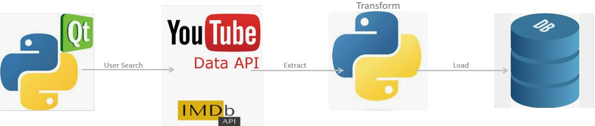

# Movies_ETL
GUI application that retrieves movie data based on user's search and loads results into the database file. 

#### Example Run

# Requirements
Obtain API Keys from both [YouTube](https://developers.google.com/youtube/) and [IMDb](https://developer.imdb.com/)

# Pip Installs
-PyQt5.QtWidgets
-PyQt5.QtCore
-PyQt5.QtGui
-PyQt5.QtWebEngineWidgets
-sqlite3
