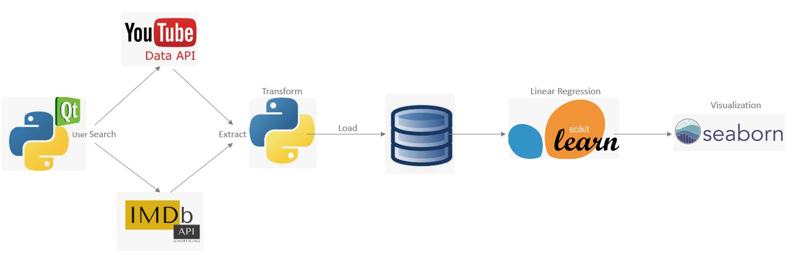
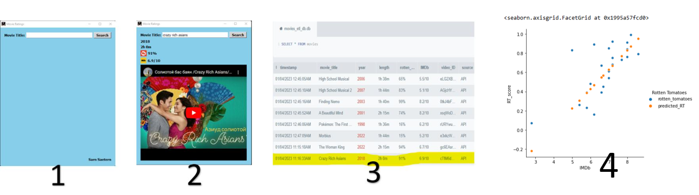

# Movies_ETL
GUI application that retrieves movie data based on the user's search, then loads results into a database file. 
  Analysis of relationship between IMDb and Rotten Tomato scores conducted using linear regression and hypothesis testing.

# Example Run

# Releases
v.01 movies_etl executable file (113,554KB) available for [download](https://github.com/SarnSaetern15/Movies_ETL/releases/tag/v01) 

# Requirements
Obtain API Keys from both [YouTube](https://developers.google.com/youtube/) and [IMDb](https://developer.imdb.com/)

# Pip Installs
* PyQt5.QtWidgets
* PyQt5.QtCore
* PyQt5.QtGui
* PyQt5.QtWebEngineWidgets
* sqlite3
* requests
* pandas
* sklearn.model_selection
* sklearn.linear_model
* seaborn
* statsmodels.formula.api
